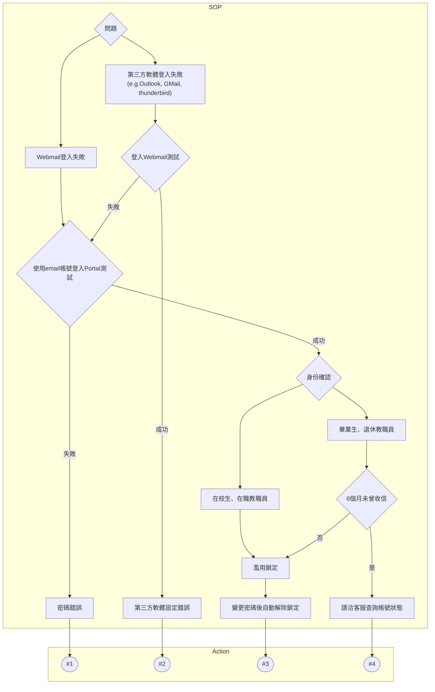

 

---

 

- #0, 第三方軟體:e.g. PC(Outlook, thunderbird), GMail, Outlook.com

- #1, 忘記密碼:
    - 若有在 Portal 有綁定"計中帳號"的備用電子信箱, 可透過備用電子信箱設定密碼: https://portal.ncu.edu.tw/reset-password
    - 若無, 則透過以下說明變更密碼: https://www.cc.ncu.edu.tw/page/account_password

- #2, [第三方郵件軟體設定](../articles/config.md)

- #3, 變更密碼:
    - https://portal.ncu.edu.tw/my/profile/password
    
- #4, 客服:
    - 計中服務櫃台, 03-4227151, 分機57555, 57566
    - Email: ncucc@cc.ncu.edu.tw
